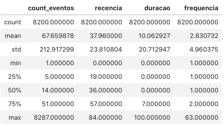
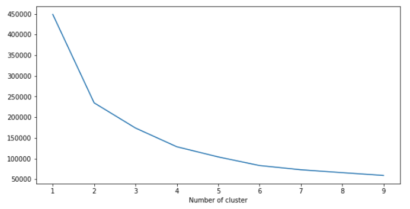
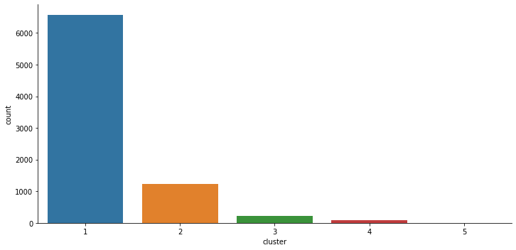
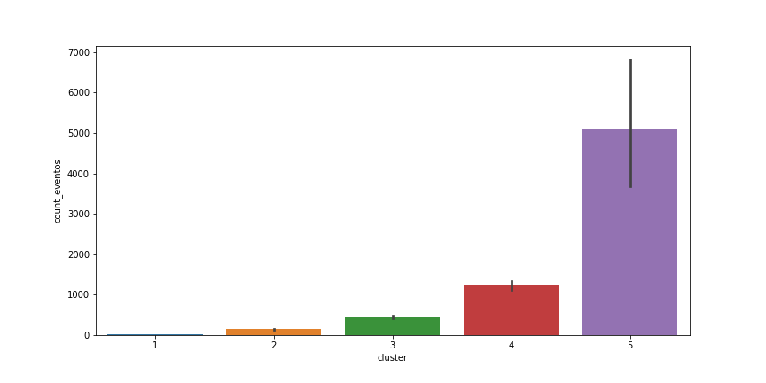

## The project
- [A bit of context](#a-bit-of-context)
- [What do we want to discover?](#what-do-we-want-to-discover-)
- [Phase 1: Importing the data](#phase-1--importing-the-data)
- [Phase 2: Preparing the data](#phase-2--preparing-the-data)
- [Phase 3: Exploratory analysis](#phase-3--exploratory-analysis)
- [Phase 4: Number of groups and the algorithm](#phase-4--number-of-groups-and-the-algorithm)
  - [*Normalization*](#-normalization-)
  - [*Determining the number of clusters*](#-determining-the-number-of-clusters-)
  - [Running **K-means**](#running---k-means--)
- [Phase 5: Finally, the long-awaited clusterization](#phase-5--finally--the-long-awaited-clusterization)
  - [Macro-Group 1: Common Users (99% of users)](#macro-group-1--common-users--99--of-users-)
  - [1.1: Bounces (6568 users, 81%)](#11--bounces--6568-users--81--)
  - [1.2: Occasional (1230 users, 15%)](#12--occasional--1230-users--15--)
  - [1.3: Frequent Users (210 users, 2.6%)](#13--frequent-users--210-users--26--)
  - [Macro-Group 2: Outliers (>1% of users)](#macro-group-2--outliers---1--of-users-)
  - [2.1: Mini-Whales (79 users, 0.9%)](#21--mini-whales--79-users--09--)
  - [2.2: Whales (5 users, 0.06%)](#22--whales--5-users--006--)
- [So, what are the next steps?](#so--what-are-the-next-steps-)
  - [Redo the analysis with fresher data](#redo-the-analysis-with-fresher-data)
  - [Put RFDV in production](#put-rfdv-in-production)
  - [**Cross data with the signup form**](#--cross-data-with-the-signup-form--)
  - [Proceed to qualitative research](#proceed-to-qualitative-research)
  - [**Understand the mobile issue**](#--understand-the-mobile-issue--)
  - [Experiment with more features](#experiment-with-more-features)

## A bit of context

The freemium option of a SaaS startup was publicly launched in February 2020, and 7 months later, at the beginning of August, about 15,000 people had already created an account.

As a researcher and designer on the team that created this new product, we needed to understand how people were engaging with it and what the main behaviour profiles were.

In May, we conducted an in-depth qualitative research, crossing product usage metrics, a survey sent to the entire user base and in-depth interviews with different profiles of active users.

We chose Mixpanel to be our central hub for product metrics, but initially struggled to learn how to use it correctly and only started to have a clean and consistent data at the beginning of May.

It is this historical series between the beginning of May and the end of August that we will analyze here.

## What do we want to discover?

What are the main engagement patterns? And what proportion of the base does each group represent?

From the start, we struggled to understand user engagement with the product. Why do some people use it so much and others so little? Why users log in every day and then disappear? Why some log in once and never return?

We have some hypotheses of profiles, based on day to day observation of the data, such as:

- Those who register, use a lot, and never return.
- Those who use it only a few days a month but return every month.
- Those who use it a lot, take a break for a few months, and then start using it again.
- Those who start off very engaged and gradually stop.

But are these really the main behavioral profiles? And how many users do we have in each group? And what are the specific numbers? How many days a month do they return? How many events do they perform?

These are quite difficult to extract with the tools we currently have in Mixpanel.

## Phase 1: Importing the data

*This stage does not have a link to the code because it could contain sensitive data*

First, we collected raw data. Fortunately, the hardest work had already been done in the Mixpanel implementation, so it was just a matter of downloading and cleaning the data.

I had to download and install the outdated Mixpanel API in Python 2.0 (!) and make two calls.

First, downloading all user profiles from the Free Plan, and then the tables of twelve types of events made by these users between May 3rd and August 8th, which include:

1. Searching for a company by CNPJ (Brazilian business ID number)
2. Searching for a company by name
3. Clicking to view a company similar to the one searched for
4. Adding a company to the sales funnel
5. Visiting the sales funnel page
6. Visiting the plans page

And more...

Why these events? They demonstrate significant human interaction with the product, unlike events like "logout" or "close banner," and together, they account for almost 98% of all collected events.

**Future improvement**: Here, we downloaded all user profiles in the Free Plan, but this means that users who migrated to a paid plan at some point in the historical series will not be counted. This is unfortunate because it would be useful to know the behavior of users before they became paying customers.

## Phase 2: Preparing the data

They say the most laborious part of data science is preparing the data, and they are absolutely right because this was indeed the longest and most arduous part of the process.

**Data Cleaning**

Right after exporting data via Mixpanel's API, I cleaned the data:

- removed all users who registered before or after the historical series (from May 3rd to August 8th)
- removed profile columns with sensitive data (name, phone, email, company), or irrelevant ones (answers given in signup fields that no longer exist)
- removed users with @startup emails to exclude our own test accounts from the analysis
- in the consolidated event table, I left only the columns with the user ID, name, and event date and discarded all the other 20+ columns containing information like the browser used during the event, credits held, etc.
  
Theoretically, all this could have been done directly in the API query, and it would have returned the data already clean, but since it is quite slow and confusing, I preferred to download raw data and clean it manually. By the end of the process, we had about 8,200 profiles ready to receive the RFDV.

**Feature Engineering: Creating the RFDV (The code for this can be found on GitHub!)**

*See the process in [01-feature-engineering-RFDV](01-feature-engineering-RFDV.ipynb)*

We started with the two simplest metrics, Recency and Duration, first transforming the dates from Mixpanel into UnixTime in DateTime format.

**Recency**

For Recency, we already had a column from Mixpanel with the last access date of that user, so it was just a matter of comparing the number of days between that date and the end of the historical series, which was August 8th.

Future improvement: Here, we calculated Recency by considering the last time the user was seen by Mixpanel. Sometimes it considers simple things like opting out of receiving emails as "product usage." A more sophisticated way of calculating this would be to analyze the last time the user performed one of the 12 engagement events in the consolidated events table. The same applies to Duration.

**Duration**

For Duration, the process was similar. We compared the column from Mixpanel with the user's creation date to the last time they were seen, measuring the distance in days.

**Volume**

Next, we moved on to Volume, counting how many times the user's Unique ID appeared in our consolidated events table.

**Frequency**

The last and most complex was Frequency, which is calculating how many distinct days users used the platform. We also grouped the consolidated events table by Unique ID and used Pandas functions to count the unique days.

## Phase 3: Exploratory analysis

*See the process in [02-análise-exploratória](02-análise-exploratória.ipynb)*

With our clean profiles and events, it was time to listen to what these raw data could tell us.

Some insights:

- The median volume of events is 14, while the mean is 67, almost five times higher, indicating that we have an uneven distribution, with some users performing far more events than the mean, pulling it up.
- The same occurs with Duration, where the median is 0 days (i.e., they only logged in once), but the mean is 10 days.
- Duration has a strong relationship with Frequency, which is natural because the more distinct days you access, the longer the distance between your first and last access, i.e., Duration.

Sadly, nothing we hadn't already intuited from observing these users day to day.

## Phase 4: Number of groups and the algorithm

*See the process in [03-clusterizacao-kmeans](03-clusterizacao-kmeans.ipynb)*

Let's move on to the real deal: real official data science, machine learning, artificial intelligence ™️, etc.

We'll use K-means because it's a classic for clustering and quite simple to implement, perfect for a first attempt.

### *Normalization*

Since K-means is a linear algebra algorithm, it is very sensitive to the type of data it receives and naturally only accepts numerical data. So first, we'll separate our data into numerical and categorical, and then adjust them.

Our numerical data are only those from RFDV, and we tested a few normalizations, such as Log, MinMax, and finally, the Robust Scaler, which uses some clever statistical tricks to balance the data and is particularly useful in cases with heavy outliers, which is our situation.

Having resolved this, we applied a "One-Hot" encoding to the categorical data, transforming all options into columns. If the user has that property, they receive a "1" in that column; if they don't, it remains "0."

In other words, instead of being "City: São Paulo," it becomes "São Paulo: 1, Manaus: 0, Florianópolis: 0, ..." and so on. The problem with this method is that it generates many columns in our table. In this case, from 7 to 12,229, yikes.

### *Determining the number of clusters*

The problem now is determining how many groups we will have. The "K" in K-means is the number of clusters, and we have to specify it. We can guess it intuitively or conduct manual experiments, but there are more scientific ways to determine an ideal number.

In our case, we performed the famous "elbow test" using "inertia." Essentially, it runs the algorithm multiple times, starting with two groups and going up to the limit you set, and performs a statistical analysis of the amount of variation within the clusters in each of these tests. Generally, after a certain number of clusters, adding more will result in very similar clusters, so the ideal point is right after this "elbow," where splitting into more groups won't help much in understanding the data's differences.

In our case, the elbow test yielded around 5 groups, and that's what we'll use.

### Running **K-means**

Having collected, cleaned, normalized all data, and determined the number of clusters, running the algorithm itself is incredibly simple, just a few lines of code.

Here, it already returns the cluster each user belongs to in our user table, and we can begin analyzing.

## Phase 5: Finally, the long-awaited clusterization

*See the process in [04-análise-final](04-análise-final.ipynb)*

Clustering with 5 groups using K-means produced quite interesting results: one large group with the majority of our users, two smaller groups with almost all the others, and two final groups with the "outliers."

The first thing that stands out is the inverse relationship between the number of users in the cluster and the average volume of events. In other words, it validates our hypothesis that most users are performing very few events, contrasting with small groups that are highly engaged.

From this perspective, we can create two macro-groups, name our clusters, and derive some insights.

### Macro-Group 1: Common Users (99% of users)

### 1.1: Bounces (6568 users, 81%)

- 6,612 users in the sample
- 25% use the product on a mobile device
- They performed only 10 events
- Almost all log in on only one day and don't return

**Hypotheses:**
- These are people looking for a specific piece of data.
- They may not know that the Federal Revenue Service website or similar sources provide this data without registration.
- They perform more data collection events, such as copying email and phone numbers.

### 1.2: Occasional (1230 users, 15%)

- 4% use the product on a mobile device
- They perform 100 events, about 7 times more than the median
- They spent nearly 40 days interacting with the platform
- During this period, they logged in on 5 distinct days
- Or once every 5 days

### 1.3: Frequent Users (210 users, 2.6%)

- 10% use the product on a mobile device
- They performed 361 events, or about 26 times more than the median
- They spent nearly 77 days interacting with the platform, almost the entire historical series
- During this period, they logged in on 23 distinct days
- Or once every 3 days

**Hypotheses:**

- These are people who need to validate data regularly.
- Some are enriching external lists.
- Others are validating data not related to the commercial process, such as accountants and lawyers.

### Macro-Group 2: Outliers (>1% of users)

### 2.1: Mini-Whales (79 users, 0.9%)

- They are very similar to the Whales but perform four times fewer events.
- 2.5% use the product on a mobile device
- They performed 1,107 events, or about 79 times more than the median
- They spent nearly 50 days interacting with the platform, almost the entire historical series
- During this period, they logged in on 12 distinct days
- Or once every 4 days

### 2.2: Whales (5 users, 0.06%)

- None used a mobile device
- They performed 4,296 events (!), or about 306 times more than the median
- Similar to the Frequent Users, they spent nearly 77 days interacting with the platform
- During this period, they logged in on 12 distinct days
- Or once every 6 days

## So, what are the next steps?

### Redo the analysis with fresher data

Between the data collection and the end of this project, two months have passed, and our product is moving quickly, so it would be good to redo the analysis with the time frame from July 6th to September 26th, the third quarter of the year, and then compare the results. Will the groups remain similar?

### Put RFDV in production

With or without clusters, RFDV alone provided great visibility into behavior and would be an excellent addition to our current product metrics. We can find a way to use Mixpanel's API to create these features and keep our entire user base updated with them.

### **Cross data with the signup form**

Upon registering, people answer a few simple questions about their professional activity and the company they work for. Although the data may not be very consistent or accurate, it would be interesting to cross-reference it with the clusters to see if clear patterns emerge.
Knowing the main behavioral groups, do people in these groups share common characteristics, as we suppose?

### Proceed to qualitative research

As a UX researcher, I would like to interview some of these people, especially the most engaged ones, to understand if there are differences in tasks within these groups. Why do some of these people use the product so much more? What does our product help them accomplish?

For example, do the Mini-Whales tend to be administrative assistants, perhaps working on a specific project?

Could the Occasional Users be small business owners or self-employed, perhaps just collecting data to create invoices?

### **Understand the mobile issue**

One in five users accesses via mobile devices, and almost all of them use it only once and don't return. Are the people who arrive at our product via mobile different, or is our product not suited to this platform, or both?

### Experiment with more features

It would be interesting to run K-means again with more features to see if it returns something even more instructive. We can create:

- If they registered before the credit limit
- If they have a commercial email or not
- If they are domestic or international
- Ratio: volume divided by frequency
- Recurrence: duration divided by frequency
- Whether they sell to B2B, B2C, or both
